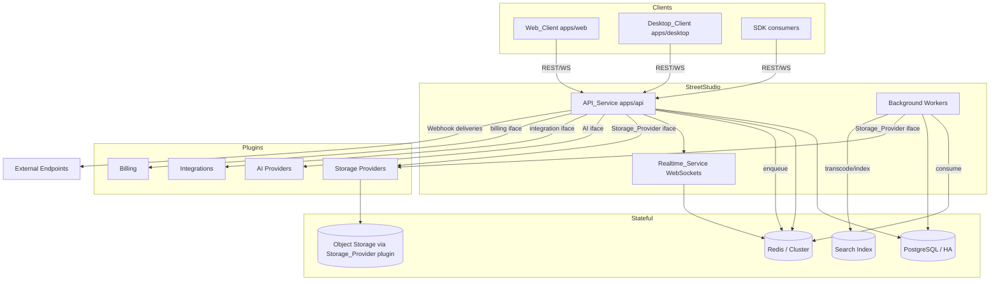
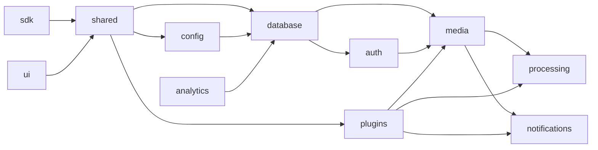
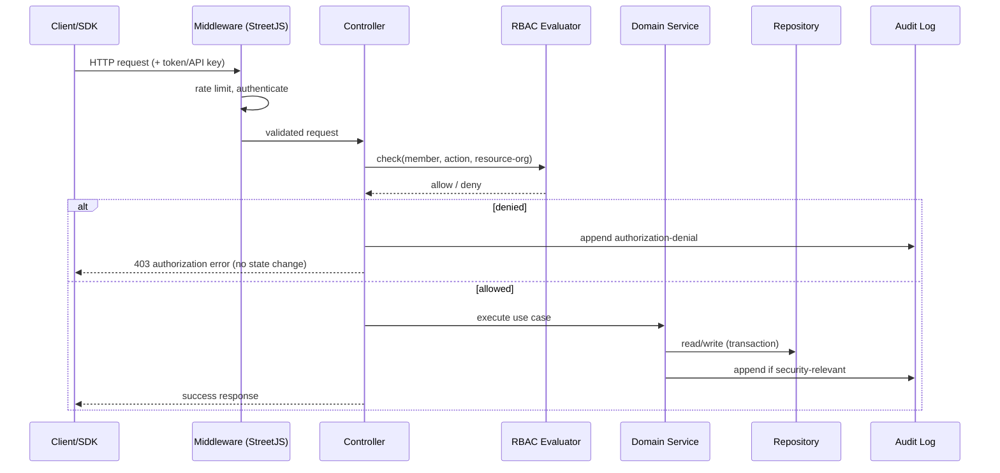
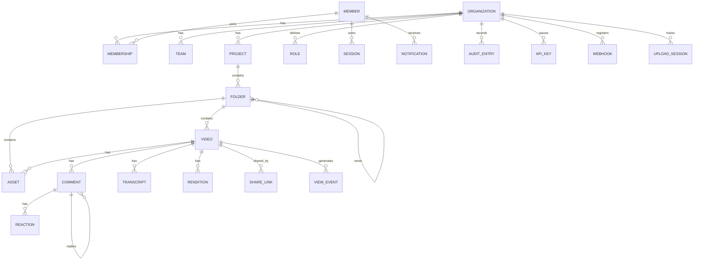

# Design Document

## Overview

StreetStudio is an independent, open-source asynchronous collaboration platform for video/screen recording, review, and knowledge sharing. It is the flagship application built on the StreetJS framework, which it consumes **exclusively** through published package versions or local package links (workspace/linked entries). StreetStudio never imports StreetJS internals, never modifies StreetJS source, and contains no StreetJS source in its own repository.

This design translates the 32 approved requirements into a concrete architecture: a modular monorepo of `apps/*` and `packages/*`, an API-first backend that exposes full UI/API parity over REST + WebSocket + Webhooks + SDK, a plugin-first extensibility model (storage, AI, integrations, billing all delivered as plugins with no hardcoded vendors), security-by-default, and horizontal scalability.

### Design Goals

- **Boundary integrity**: StreetJS is a black box consumed only via public entry points. A build-time boundary check fails the build on any disallowed import.
- **Single-responsibility packages**: each package declares one domain responsibility, exposes an entry-point-only public surface, and participates in an acyclic dependency graph enforced by CI.
- **Plugin-first**: every vendor-specific concern (storage backends, AI, chat/source-control integrations, billing) is a plugin loaded through the StreetJS plugin loader and isolated from core.
- **API-first parity**: no Web_Client capability exists that is not reachable through the public REST/WebSocket/Webhook API and the SDK.
- **Security-by-default**: rate limiting, encrypted secrets, short-lived signed upload credentials, deny-by-default authorization, and append-only audit logging are enabled without extra configuration.
- **Self-hostable & horizontally scalable**: stateless API nodes behind shared PostgreSQL and Redis (with HA/Cluster variants), background workers, and pluggable object storage.

### How StreetJS Is Used

StreetStudio delegates the following framework concerns to StreetJS public packages: HTTP serving, routing, controllers, request validation, configuration, dependency injection, sessions, PostgreSQL access, Redis access, Redis Cluster, PostgreSQL HA, queues, scheduling, storage interfaces, WebSockets, plugin loading, metrics, health checks, logging, CLI, resilience (retries/circuit breakers), and secret management. StreetStudio owns all domain logic (organizations, recording, media pipeline, comments, RBAC, sharing, etc.) in its own packages.

Where a needed capability is missing from StreetJS, StreetStudio implements it inside a StreetStudio package (importing StreetJS only through public entry points) and records the gap in documentation with a link to an external StreetJS issue — never patching StreetJS.

## Architecture

### System Context



### Runtime Topology

- **API_Service (`apps/api`)**: stateless StreetJS HTTP application hosting REST controllers and the WebSocket gateway. Multiple instances run behind a load balancer. All shared state lives in PostgreSQL, Redis, and object storage, so any instance can serve any request.
- **Background Workers**: consume StreetJS queues (backed by Redis) for the media pipeline, webhook delivery, notification fan-out, transcript indexing, and AI jobs. Workers scale independently of the API tier.
- **Realtime_Service**: a logical subsystem inside the API tier using StreetJS WebSockets. Cross-instance fan-out uses a Redis pub/sub backplane so an event produced on one node reaches subscribers connected to any node.
- **Scheduler**: StreetJS scheduling drives periodic tasks — expiring upload sessions, expiring invitations, purging expired share links, retrying stalled deliveries.

### Monorepo Structure

```
StreetStudio/
├── apps/
│   ├── api/         # API_Service: REST + WebSocket + Webhook host (StreetJS app)
│   ├── web/         # Web_Client (browser SPA)
│   ├── desktop/     # Desktop_Client (wraps web + native capture)
│   └── docs/        # Documentation site
├── packages/
│   ├── ui/          # Shared UI components (web + desktop)
│   ├── sdk/         # Public client library (REST + WebSocket)
│   ├── shared/      # Cross-cutting types, DTOs, errors, constants
│   ├── config/      # Config schema + loading via StreetJS config
│   ├── database/    # Schema, migrations, repositories (StreetJS PostgreSQL)
│   ├── auth/        # Authentication, sessions, RBAC, API keys
│   ├── media/       # Media domain: videos, assets, storage abstraction
│   ├── recording/   # Recorder capture + chunked/resumable upload client logic
│   ├── processing/  # Media pipeline: transcode, thumbnail, preview
│   ├── notifications/ # Notifications + realtime event contracts
│   ├── plugins/     # Plugin_Manager, plugin contracts, isolation
│   └── analytics/   # View events + aggregation
├── docker/          # Container images + compose
├── infrastructure/  # Deployment configuration (self-hosting)
└── docs (top-level)/ # README, ARCHITECTURE, ROADMAP, CONTRIBUTING, SECURITY, API, PLUGIN_GUIDE, MEDIA_PIPELINE, DEPLOYMENT, DECISIONS
```

Each package declares a single primary domain responsibility in its manifest and exposes functionality only through declared entry points. The dependency graph is acyclic; a representative layering:



`apps/*` may depend on `packages/*`; `packages/*` never depend on `apps/*`.

### Boundary and Import Enforcement

Two boundary rules are enforced at build/CI time (Requirements 1, 2, 22):

1. **StreetJS boundary**: no import may resolve to a StreetJS internal module or to a file-system path inside the StreetJS repository. Only StreetJS public package entry points are permitted.
2. **Package boundary**: no cross-package import may resolve to another package's internal module; only declared entry points are allowed. The graph must stay acyclic.
3. **AI vendor boundary**: platform core code (anything outside a billing/AI plugin) may not import or reference a specific AI or billing vendor implementation.

These are implemented as a custom static-analysis lint step (`packages/config` build tooling) that inspects resolved import specifiers against an allowlist and dependency-graph rules, producing a named error on violation and failing the build.

### Request Lifecycle



## Components and Interfaces

This section describes the primary subsystems, the package that owns each, and the public interfaces they expose. Interfaces are shown in TypeScript-style signatures for clarity; concrete implementation uses StreetJS DI to wire dependencies.

### Authentication & Session (`packages/auth`)

Owns Member authentication, JWT issuance, session lifecycle, OAuth/SSO, account lockout, API keys, and RBAC evaluation.

```typescript
interface AuthService {
  register(input: { email: string; password: string }): Promise<Member>;          // R3.1, R3.8
  login(input: { email: string; password: string }): Promise<AuthResult>;         // R3.2, R3.3, R3.9
  logout(sessionId: string): Promise<void>;                                        // R3.4
  verifyAccessToken(token: string): Promise<AuthContext>;                          // R3.7
  loginWithOAuth(provider: string, code: string): Promise<AuthResult>;             // R3.5, R3.10
  loginWithSSO(provider: string, assertion: string): Promise<AuthResult>;          // R3.6, R3.10
}

interface AuthResult { accessToken: string; expiresAt: Date; sessionId: string; } // token TTL <= 15 min

interface LockoutPolicy {
  recordFailure(email: string): Promise<void>;
  isLocked(email: string): Promise<boolean>;   // >=5 failures / 15 min => lock >=15 min (R3.9)
}
```

- Passwords are hashed with a memory-hard algorithm (Argon2id); plaintext is never stored.
- Access tokens are JWTs with `exp <= 15 minutes`; sessions are recorded in PostgreSQL/Redis and validated on each request so logout/expiry invalidates access (R3.2, R3.4, R3.7).
- Authentication errors are uniform and never disclose which credential failed or whether an email/API key exists (R3.3, R3.8, R18.5).
- OAuth/SSO provider failures deny sign-in and create no session (R3.10).

### API Key Service (`packages/auth`)

```typescript
interface ApiKeyService {
  create(orgId: string, actor: MemberId, name: string): Promise<{ apiKey: ApiKeyMeta; secret: string }>; // secret returned once (R18.1)
  getMeta(keyId: string): Promise<ApiKeyMeta>;      // never returns secret (R18.2)
  authenticate(presented: string): Promise<AuthContext>; // valid+non-revoked only (R18.3, R18.5)
  revoke(keyId: string, actor: MemberId): Promise<void>;  // R18.4
}
```

Only a salted hash of the secret is stored; the plaintext secret is returned exactly once at creation and is never retrievable afterward (R18.1, R18.2).

### RBAC Evaluator (`packages/auth`)

```typescript
interface AccessControl {
  can(ctx: AuthContext, action: Action, resource: ResourceRef): Promise<boolean>;
  assignRole(actor: AuthContext, orgId: string, member: MemberId, role: RoleName): Promise<void>; // R16.2, R16.5, R16.6
}
// Deny-by-default. Permissions are evaluated in the Organization scope that OWNS the resource (R16.1, R16.4).
```

Every authenticated read/modify request is evaluated against the requesting Member's Role permissions in the owning Organization's scope before the action runs; roles never leak across organizations (R16.1, R16.4, R20.4).

### Organization & Membership Service (`packages/database` domain services)

```typescript
interface OrgService {
  createOrg(actor: AuthContext, name: string): Promise<Organization>;          // 1..200 chars (R4.1, R4.7)
  invite(actor: AuthContext, orgId: string, email: string): Promise<Invitation>; // expires +7d (R4.2, R4.8)
  acceptInvitation(token: string, member: MemberId): Promise<Membership>;      // R4.3, R4.9
  createTeam(actor: AuthContext, orgId: string, name: string): Promise<Team>;  // R4.4
  assignToTeam(actor: AuthContext, teamId: string, member: MemberId): Promise<void>; // R4.5
  removeMember(actor: AuthContext, orgId: string, member: MemberId): Promise<void>; // R26.2, R26.6
  updateSettings(actor: AuthContext, orgId: string, patch: OrgSettings): Promise<Organization>; // R26.1, R26.5
}
```

Creating an organization assigns the creator the Administrator role. Removing the last Administrator is rejected (R26.6). Membership operations are org-scoped and authorization-checked (R4.6).

### Content Hierarchy Service (`packages/media`)

```typescript
interface ContentService {
  createProject(actor: AuthContext, orgId: string, name: string): Promise<Project>; // 1..255 (R5.1, R5.6, R5.8)
  createFolder(actor: AuthContext, parent: FolderRef, name: string): Promise<Folder>; // depth <=10 (R5.2, R5.3, R5.8)
  moveVideo(actor: AuthContext, videoId: string, targetFolder: FolderRef): Promise<Video>; // same-org only (R5.4, R5.7)
  createWorkspace(actor: AuthContext, orgId: string, name: string): Promise<Workspace>; // R5.5
}
```

Moving a Video within the same Organization preserves identity, comments, transcripts, and permissions; cross-organization moves are rejected (R5.4, R5.7). Folder nesting is capped at depth 10 (R5.3).

### Recorder (`packages/recording`, consumed by `apps/web` and `apps/desktop`)

Client-side capture plus the chunked/resumable upload client.

```typescript
interface Recorder {
  start(sources: CaptureSources): Promise<RecordingSession>; // screen/window/region (R6.1..R6.4)
  pause(): void;   // suspend capture, retain media (R6.8)
  resume(): void;
  stop(): Promise<Recording>; // finalize <=10s then upload (R6.9)
}
interface CaptureSources { screen: ScreenTarget; camera?: boolean; microphone?: boolean; systemAudio?: boolean; }
```

- Missing/unsupported system audio continues without it and notifies the Member (R6.5); denied capture permission aborts and retains nothing (R6.6).
- Cursor highlighting/drawing tools and keyboard shortcuts are provided during recording (R6.7, R6.12).
- Offline stops persist locally and upload with up to 5 retries when connectivity returns (R6.10, R6.11).

### Chunked Upload Service (`apps/api` upload controller + `packages/media`)

```typescript
interface UploadService {
  initSession(actor: AuthContext, meta: UploadMeta): Promise<UploadSession>; // totalChunks known
  putChunk(sessionId: string, index: number, bytes: Buffer, checksum: string): Promise<ChunkAck>; // 1..100 MB (R7.1, R7.4)
  status(sessionId: string): Promise<UploadStatus>;
  complete(sessionId: string): Promise<Video>; // assemble in order (R7.3)
}
```

- Each chunk (1 MB–100 MB) is integrity-checked; failures are rejected without persisting, retried up to 3 times, and exhaustion aborts the session (R7.4, R7.5).
- Resuming within the 24h session lifetime continues from the chunk after the last acknowledged one without retransmitting acknowledged chunks (R7.2); sessions idle past 24h expire and discard partial chunks (R7.6).
- Each acknowledgment emits an upload-progress realtime event reporting acknowledged/total (R7.7).

### Media Pipeline (`packages/processing`, run in workers)

```typescript
interface MediaPipeline {
  enqueue(videoId: string): Promise<void>;         // within 5s of upload completion (R8.1)
  process(job: ProcessingJob): Promise<ProcessingResult>;
}
interface ProcessingResult {
  thumbnail: AssetRef;         // exactly one (R8.2)
  preview: AssetRef;           // 3..10s (R8.3)
  renditions: Rendition[];     // >=3 ABR renditions (R8.4)
  status: 'ready' | 'failed';
}
```

Processing emits status transitions (`queued|processing|ready|failed`) to Members with access within 2s per transition (R8.5). Failures retry up to 3 times; on exhaustion the pipeline records failure, retains the original source, and emits a failure event (R8.6). Success marks the Video `ready` (R8.7).

### Storage Abstraction (`packages/media` interface, providers are plugins)

```typescript
interface StorageProvider {
  put(key: string, stream: ReadableStream): Promise<PutResult>;   // ack within 30s or fail (R9.5)
  get(key: string): Promise<ReadableStream>;
  signUploadTarget(key: string, ttlSeconds: number): Promise<SignedTarget>; // 60..3600, default 900 (R9.6)
  healthCheck(): Promise<void>;   // connectivity check on activation (R9.4)
}
```

Persistence flows exclusively through this interface (R9.1). Providers for Local, S3, R2, Azure Blob, GCS, and MinIO are plugins (R9.2). Activating a provider with missing config or a failing connectivity check is rejected and retains the prior provider (R9.4). Signed upload credentials for direct-to-storage uploads expire within 15 minutes (R9.6 default 900s, R29.3), and expired targets are rejected (R9.7).

### Streaming & Playback (`packages/media`)

```typescript
interface PlaybackService {
  getManifest(ctx: AccessContext, videoId: string): Promise<StreamManifest>; // ready only, <=3s (R10.1, R10.3)
}
```

Playback requires view permission or a valid share credential; denied/without-permission requests return no manifest and an authorization error (R10.2, R10.4, R10.5).

### Comments, Threads, Reactions (`packages/media`)

```typescript
interface CommentService {
  post(ctx: AccessContext, videoId: string, body: string, timestamp?: number): Promise<Comment>; // 1..5000, 0..duration (R11.1, R11.2, R11.8, R11.9)
  reply(ctx: AccessContext, parentId: string, body: string): Promise<Comment>; // R11.3
  react(ctx: AccessContext, target: ReactionTarget, type: ReactionType): Promise<void>; // <=1 per type/member/target (R11.5)
  mention(commentId: string, mentioned: MemberId): Promise<void>; // notify within 2s if has view access (R11.4)
}
```

New comments and typing indicators fan out to concurrent viewers within 2s (R11.6, R13.2).

### Notifications (`packages/notifications`)

```typescript
interface NotificationService {
  create(memberId: string, event: EventRef): Promise<Notification>; // within 5s, respects prefs (R12.1, R12.4)
  markRead(memberId: string, notificationId: string): Promise<void>; // ownership-checked (R12.3, R12.6)
  deliverPending(memberId: string): Promise<void>; // on reconnect within 5s (R12.5)
}
```

Connected members receive notifications within 2s (R12.2); undelivered ones are retained and delivered within 5s of reconnect (R12.5).

### Realtime_Service (`packages/notifications` contracts + `apps/api` gateway)

```typescript
interface RealtimeGateway {
  join(memberId: string, workspaceId: string): Promise<void>;  // presence event to others <=2s (R13.1)
  leave(memberId: string, workspaceId: string): Promise<void>; // departure <=2s (R13.3)
  emit(event: RealtimeEvent, audience: Audience): Promise<void>;
}
// Event types: upload-progress, processing-status, live-comment, notification,
// presence-join, presence-leave, typing-start, typing-stop, workspace-event (R13.4)
```

Delivered over StreetJS WebSockets with a Redis backplane for cross-node fan-out. Dropped connections emit a presence-departure within 5s (R13.6); events for members with no active connection are discarded without affecting others (R13.7). Typing indicators start on typing and stop after 5s of inactivity (R13.2, R13.5).

### Search (`packages/media` + search index)

```typescript
interface SearchService {
  search(ctx: AuthContext, query: string, page?: Cursor): Promise<SearchPage>; // 1..500 chars, <=3s, <=100/page (R14.1, R14.3, R14.5, R14.6)
}
interface SearchPage { results: SearchHit[]; nextCursor?: Cursor; }
interface SearchHit { resource: ResourceRef; transcriptPosition?: number; } // R14.2
```

Results are always filtered to the requesting Member's authorized scope (R14.4). Transcript matches include the matching playback position (R14.2).

### Sharing & Content Permissions (`packages/media`)

```typescript
interface ShareService {
  createLink(ctx: AccessContext, videoId: string, opts: ShareOptions): Promise<ShareCredential>; // globally unique (R15.1)
  revoke(ctx: AccessContext, credentialId: string): Promise<void>; // R15.3
  resolve(credential: string, passcode?: string): Promise<ShareAccess>; // expiry/revoke/passcode (R15.2, R15.5, R15.6, R15.7)
}
interface ShareOptions { expiresAt?: Date; passcode?: string; }
```

Passcode-protected links lock for at least 15 minutes after 5 consecutive incorrect attempts (R15.7). All resource reads/writes enforce content permission and make no change on denial (R15.4).

### Audit Log (`packages/database`, append-only)

```typescript
interface AuditLog {
  append(entry: { actor: string; action: string; targetId: string; orgId: string; at: Date }): Promise<void>; // <=5s, ms precision (R17.1)
  query(actor: AuthContext, orgId: string, page?: Cursor): Promise<AuditEntry[]>; // desc, org-scoped, admin-only (R17.3, R17.5)
}
// No update/delete operations are exposed; storage layer rejects mutation (R17.2, R17.6).
```

Records authentication events, authorization denials, sharing changes, and administrative actions (R17.4).

### Webhooks (`apps/api` + worker delivery)

```typescript
interface WebhookService {
  register(ctx: AuthContext, eventType: string, url: string): Promise<Subscription>; // HTTPS, <=2048, supported type (R19.1, R19.2)
  delete(ctx: AuthContext, subId: string): Promise<void>; // stop within 60s (R19.7)
  deliver(event: PlatformEvent): Promise<void>; // signed, within 30s (R19.3, R19.4)
}
// Delivery: 10s response timeout; retry up to 5 more times with exponential backoff (R19.5, R19.6).
```

### SDK (`packages/sdk`)

Generated/maintained from the public API contract; provides typed client access to every public REST and WebSocket interface (R20.2). Released in lockstep with contract changes and honoring the 90-day deprecation window for breaking changes (R20.3, R20.6).

### Plugin_Manager (`packages/plugins`)

```typescript
interface PluginManager {
  discoverAndLoad(): Promise<LoadReport>;             // via StreetJS loader, <=30s/plugin (R21.1, R21.5)
  enable(actor: AuthContext, pluginId: string): Promise<void>;  // activate+register <=10s (R21.2, R21.3)
  disable(actor: AuthContext, pluginId: string): Promise<void>; // deactivate+unregister <=10s (R21.4)
}
interface PluginContext { /* no write access to platform core (R21.6, R21.7) */ }
```

Plugins run in an isolated context with no write access to core code; attempts to modify core are denied and recorded (R21.6, R21.7). A plugin that fails to load is recorded and excluded, while other plugins continue (R21.5). Failed activation leaves the plugin deactivated with prior registration state intact (R21.3). Integration plugins are supported for Slack, Discord, GitHub, GitLab, Jira, Linear, Microsoft Teams, and Notion (R21.8).

### AI Capability Router (`packages/plugins` + core services)

```typescript
interface AiRouter {
  route(capability: AiCapability, req: AiRequest): Promise<AiResult>; // transcription/summarization/action-items/semantic-search (R22.2)
}
// If no provider enabled for capability -> reject AI request <=2s; non-AI features unaffected (R22.3).
// Provider failure or >30s timeout -> abort AI request; non-AI features unaffected (R22.5).
// Core code contains no vendor implementation; build fails on vendor reference (R22.4, R22.6).
```

### Billing Abstraction (`packages/plugins` + core services)

```typescript
interface BillingGateway {
  execute(op: BillingOperation): Promise<BillingResult>; // routes to the single enabled billing plugin (R27.2)
}
// Zero direct provider references outside a billing plugin (R27.1).
// No billing plugin -> core features work; billing ops rejected "not configured" (R27.3).
// >1 billing plugin enabled -> reject configuration; route nothing (R27.4).
// Plugin failure or >30s -> error; no partial application (R27.5).
```

### Developer Mode (`packages/media` + `packages/recording`)

```typescript
interface DeveloperAssets {
  attachCodeSnippet(ctx: AccessContext, videoId: string, code: string): Promise<Asset>;    // 1..100000 (R23.1, R23.5)
  attachMarkdown(ctx: AccessContext, videoId: string, md: string): Promise<Asset>;         // 1..100000 (R23.3, R23.5)
  recordTerminal(ctx: AccessContext, videoId: string, session: TerminalCapture): Promise<Asset>; // R23.2
  attachApiRecording(ctx: AccessContext, videoId: string, rec: ApiRecording): Promise<Asset>;    // R23.4
}
// All rejected with "Developer Mode required" when the mode is disabled (R23.6).
```

### Engineering Reviews (`packages/media` + source control plugin)

```typescript
interface ReviewService {
  linkPullRequest(ctx: AccessContext, videoId: string, pr: PrRef): Promise<Association>; // enabled plugin only (R24.1, R24.2, R24.4, R24.6)
  postReviewComment(ctx: AccessContext, videoId: string, body: string, timestamp: number): Promise<Comment>; // 1..5000, 0..duration (R24.3, R24.5)
}
```

### Knowledge Base (`packages/media`)

```typescript
interface KnowledgeBase {
  indexTranscript(videoId: string, transcript: Transcript): Promise<void>; // searchable <=30s (R25.1)
  storeSummary(videoId: string, summary: string): Promise<void>;           // 1..10000, provider-produced (R25.2)
  linkDoc(ctx: AccessContext, videoId: string, url: string): Promise<DocLink>; // 1..2048, <=100/video (R25.3..R25.6)
}
```

### Analytics (`packages/analytics`)

```typescript
interface AnalyticsService {
  recordView(memberId: string, videoId: string, at: Date): Promise<void>; // org-scoped, <=5s (R28.1)
  aggregate(actor: AuthContext, orgId: string, range: TimeRange): Promise<Metrics>; // admin-only, <=5s (R28.2, R28.4, R28.5)
}
interface Metrics { totalViews: number; distinctViewers: number; totalWatchDuration: number; }
```

Analytics never include data from other organizations (R28.3), require valid time ranges (R28.5), and are Administrator-only (R28.4).

### Security Middleware & Deployment (`apps/api`, `packages/config`)

- **Rate limiting**: default 100 requests / 60s rolling window per client; excess requests are rejected with a retry-after indication (R29.1).
- **Secret management**: all secrets stored encrypted via the StreetJS secret interface; never plaintext (R29.2).
- **Auth-required by default**: unauthenticated/invalid-auth requests to non-public endpoints are denied with no state change; public endpoints are documented as requiring no auth (R29.4, R29.5).
- **Startup/health**: startup validates required config and aborts with named errors on missing/invalid values (R30.3); health and metrics endpoints are exposed via StreetJS interfaces; health reflects dependency reachability (R30.2, R30.4). HA runs against PostgreSQL HA and Redis Cluster and reconnects without operator restart (R30.5, R30.6).

## Data Models

Persisted in PostgreSQL via `packages/database` repositories (StreetJS PostgreSQL access). Identifiers are UUIDs. All tenant-scoped tables carry `organization_id` and are indexed on it to enforce org isolation.



### Core Entities

**Member**
- `id`, `email` (unique, case-insensitive), `password_hash` (Argon2id, nullable for SSO-only), `created_at`.

**Session**
- `id`, `member_id`, `issued_at`, `expires_at`, `revoked_at?`. Access-token JWTs reference a session; validity requires a live, non-revoked session (R3.2, R3.4, R3.7).

**Organization**
- `id`, `name` (1–200), `settings` (JSON), `created_at`.

**Membership**
- `organization_id`, `member_id`, `role_id`, `created_at`. Uniqueness on (`organization_id`, `member_id`).

**Role**
- `id`, `organization_id`, `name`, `permissions` (set of `Action`). Scoped to its organization only (R16.4).

**Team** / **TeamMembership**
- Team: `id`, `organization_id`, `name`. TeamMembership: (`team_id`, `member_id`).

**Invitation**
- `id`, `organization_id`, `email`, `token`, `status` (`pending|accepted|revoked|expired`), `created_at`, `expires_at = created_at + 7d` (R4.2, R4.9).

**Project**
- `id`, `organization_id`, `name` (1–255), `created_at`.

**Folder**
- `id`, `project_id`, `parent_folder_id?`, `name` (1–255), `depth` (0–9; ≤10 levels) (R5.3).

**Video**
- `id`, `organization_id`, `folder_id?`, `title`, `duration_seconds`, `status` (`uploading|queued|processing|ready|failed`), `source_object_key`, `developer_mode` flag, `created_at`. Identity is stable across folder moves (R5.4).

**Rendition**
- `id`, `video_id`, `quality`, `object_key`, `bitrate`. ≥3 per ready video (R8.4).

**Asset**
- `id`, `video_id?`, `folder_id?`, `type` (`thumbnail|preview|image|markdown|code_snippet|terminal|api_recording`), `object_key_or_body`, `created_at`. Thumbnail/preview generated by the pipeline (R8.2, R8.3); developer assets gated by Developer Mode (R23).

**Transcript**
- `id`, `video_id`, `segments` (`[{ start, end, text }]`), `indexed_at`. Powers transcript search with playback positions (R14.2, R25.1).

**Summary**
- `id`, `video_id`, `body` (1–10000), `source_plugin_id` (R25.2).

**Comment**
- `id`, `video_id`, `parent_comment_id?`, `author_id`, `body` (1–5000), `timestamp_seconds?` (0–duration), `created_at` (R11).

**Reaction**
- (`target_type`, `target_id`, `member_id`, `type`) unique — enforces at most one reaction of each type per Member per target (R11.5).

**Notification**
- `id`, `member_id`, `event_type`, `source_resource_id`, `created_at`, `read_at?`, `delivered_at?` (R12).

**NotificationPreference**
- (`member_id`, `event_type`, `enabled`) (R12.4).

**ShareLink**
- `id`, `video_id`, `credential` (globally unique), `expires_at?`, `passcode_hash?`, `revoked_at?`, `failed_attempts`, `locked_until?` (R15).

**UploadSession**
- `id`, `organization_id`, `video_id`, `total_chunks`, `acked_chunks` (bitmap/count), `last_ack_at`, `expires_at = last_ack_at + 24h`, `status` (`open|completed|expired|aborted`), per-chunk `attempts` (R7).

**AuditEntry** (append-only)
- `id`, `organization_id`, `actor_id`, `action`, `target_id`, `at` (UTC, ≥ms precision). No update/delete path (R17.1, R17.2).

**ApiKey**
- `id`, `organization_id`, `name` (1–255), `secret_hash`, `permissions`, `created_at`, `revoked_at?`. Secret plaintext returned once (R18).

**Webhook**
- `id`, `organization_id`, `event_type`, `url` (HTTPS ≤2048), `signing_secret`, `created_at`. Delivery attempts tracked separately (R19).

**PullRequestLink**
- `id`, `video_id`, `plugin_id`, `pr_ref`, `created_at` (R24).

**DocLink**
- `id`, `video_id`, `url` (1–2048), `created_at`. ≤100 per video (R25.3, R25.6).

**ViewEvent**
- `id`, `organization_id`, `video_id`, `member_id`, `at` (R28.1). Aggregations derive views/distinct viewers/watch duration.

**Plugin**
- `id`, `type` (`storage|ai|integration|billing`), `enabled`, `config` (secrets via secret manager), `load_state` (R21).

### Shared DTOs and Errors (`packages/shared`)

A single error taxonomy is shared across REST/WebSocket/SDK so behavior is uniform (see Error Handling). DTOs are the serialized wire representations of the entities above; the SDK consumes these types directly to guarantee parity.

## Correctness Properties

*A property is a characteristic or behavior that should hold true across all valid executions of a system — essentially, a formal statement about what the system should do. Properties serve as the bridge between human-readable specifications and machine-verifiable correctness guarantees.*

The following properties are derived from the acceptance-criteria prework. Each is universally quantified and intended to be implemented as a single property-based test (minimum 100 iterations). Criteria classified as SMOKE, INTEGRATION, EXAMPLE, or EDGE_CASE in the prework are covered by the Testing Strategy rather than by these properties.

### Property 1: Import boundary enforcement

*For any* import specifier, the boundary analyzer accepts it if and only if it resolves to a StreetJS public package entry point or a declared package entry point, and rejects any specifier resolving to a StreetJS internal module, a filesystem path inside the StreetJS repository, another package's internal module, or a specific AI/billing vendor implementation in core — producing a named error identifying the disallowed reference.

**Validates: Requirements 1.1, 1.3, 1.6, 2.4, 2.6, 22.6**

### Property 2: Package dependency graph is acyclic

*For any* dependency graph derived from package manifests, the acyclicity detector agrees with a reference cycle-detection algorithm, and the graph built from the real manifests contains no cycle.

**Validates: Requirements 2.5**

### Property 3: Registration creates retrievable accounts without plaintext passwords

*For any* syntactically valid, non-duplicate email and password of at least 8 characters, registration creates a Member that is retrievable, and the stored credential is never equal to the plaintext password.

**Validates: Requirements 3.1**

### Property 4: Login issues short-lived tokens with sessions

*For any* registered Member presenting correct credentials, login issues a JWT whose expiry is at most 15 minutes in the future and creates a corresponding session record.

**Validates: Requirements 3.2**

### Property 5: Invalid authentication is uniformly non-disclosing

*For any* invalid credential pair (wrong password or unknown email), authentication is rejected with an error that is identical in shape and message regardless of which element was incorrect and regardless of whether the email is registered.

**Validates: Requirements 3.3, 3.8**

### Property 6: Session and token invalidation

*For any* session, after sign-out or after its token's expiry, every subsequent request presenting that session or token is rejected with an authentication error.

**Validates: Requirements 3.4, 3.7**

### Property 7: Account lockout after repeated failures

*For any* sequence of authentication attempts against a single account, once 5 failures occur within a 15-minute window, all further attempts are rejected for at least 15 minutes.

**Validates: Requirements 3.9**

### Property 8: Organization creation validity and administrator assignment

*For any* organization name, creation succeeds if and only if the name length is between 1 and 200 characters; on success the creator holds the Administrator role, and on failure no organization is created.

**Validates: Requirements 4.1, 4.7**

### Property 9: Invitations expire seven days after creation

*For any* well-formed invitation email, the created invitation is pending with an expiry exactly 7 days after its creation time; malformed emails are rejected with no invitation created.

**Validates: Requirements 4.2, 4.8**

### Property 10: Invitation acceptance is valid only while pending and unexpired

*For any* invitation, accepting it before expiry while pending adds the invited user as a Member and marks the invitation accepted; accepting an expired, already-accepted, or revoked invitation is rejected and creates no membership.

**Validates: Requirements 4.3, 4.9**

### Property 11: Team creation and membership are organization-scoped

*For any* team created within an organization and any organization Member assigned to it, the team and its recorded memberships belong exclusively to that organization.

**Validates: Requirements 4.4, 4.5**

### Property 12: Cross-organization access is denied

*For any* Member and any organization the Member does not belong to, requests to access that organization's resources are denied with an authorization error.

**Validates: Requirements 4.6**

### Property 13: Project and folder creation validity and scoping

*For any* project or folder name, creation by a permitted Member succeeds if and only if the name length is between 1 and 255 characters, and the created resource is scoped to its parent organization/project; invalid names create no resource.

**Validates: Requirements 5.1, 5.2, 5.8**

### Property 14: Folder nesting is bounded at depth 10

*For any* folder nesting attempt, creation is allowed when the resulting depth is within 10 levels and rejected when it would exceed 10 levels.

**Validates: Requirements 5.3**

### Property 15: Video moves preserve identity and associations within the organization

*For any* Video with comments, transcripts, and permissions, moving it to another Folder in the same organization preserves its identity and all associations; moving it to a Folder outside its organization is rejected and leaves its location unchanged.

**Validates: Requirements 5.4, 5.7**

### Property 16: Create permission is required for projects and folders

*For any* Member lacking create permission, attempts to create a Project or Folder are denied with an authorization error and create no resource.

**Validates: Requirements 5.6**

### Property 17: Offline recording upload retries are bounded

*For any* sequence of upload failures for a stored offline recording, the Recorder retries at most 5 times before giving up.

**Validates: Requirements 6.11**

### Property 18: Chunk acceptance validates size and acknowledges each received chunk

*For any* ordered chunk sequence, each chunk whose size is between 1 MB and 100 MB is accepted and acknowledged, and any chunk outside that range is rejected.

**Validates: Requirements 7.1**

### Property 19: Interrupted uploads resume without retransmitting acknowledged chunks

*For any* partially uploaded Video resumed within the 24-hour session lifetime, transmission continues from the chunk immediately following the last acknowledged chunk, and no already-acknowledged chunk is re-transmitted or re-acknowledged.

**Validates: Requirements 7.2**

### Property 20: Chunk assembly round-trip reconstructs the original media

*For any* byte payload split into an ordered sequence of chunks and uploaded to completion, assembling the acknowledged chunks in order reproduces the original payload exactly.

**Validates: Requirements 7.3**

### Property 21: Chunk integrity failures are bounded and non-destructive

*For any* chunk that fails its integrity check, it is not persisted and previously acknowledged chunks remain unchanged; retransmission is attempted at most 3 times, after which the session is aborted, partial chunks are discarded, and an upload-failure response identifies the failing chunk.

**Validates: Requirements 7.4, 7.5**

### Property 22: Upload sessions expire after 24 hours of inactivity

*For any* upload session idle for 24 hours after its last acknowledged chunk, the session is expired, its partial chunks are discarded, and subsequent chunks are rejected with an expired-session error.

**Validates: Requirements 7.6**

### Property 23: Upload progress reflects acknowledged chunk count

*For any* sequence of chunk acknowledgments, each emitted progress event reports the count of acknowledged chunks relative to the total expected chunks, and the reported acknowledged count is non-decreasing.

**Validates: Requirements 7.7**

### Property 24: Processing produces the required outputs

*For any* successfully processed Video, the pipeline produces exactly one thumbnail, a preview of 3 to 10 seconds, at least 3 adaptive-bitrate renditions, and marks the Video ready.

**Validates: Requirements 8.2, 8.3, 8.4, 8.7**

### Property 25: Processing status events use only defined status values

*For any* processing lifecycle, each emitted processing-status event carries exactly one of the values queued, processing, ready, or failed, and one event is emitted per stage transition.

**Validates: Requirements 8.5**

### Property 26: Processing failures are bounded and preserve the source

*For any* Video whose processing fails, the pipeline retries at most 3 times; on exhaustion it records a failure status, retains the original source media, and emits a processing-failure event.

**Validates: Requirements 8.6**

### Property 27: Storage round-trip preserves object bytes

*For any* media object written through the Storage_Provider interface, retrieving it returns bytes identical to those written.

**Validates: Requirements 9.1**

### Property 28: Storage provider activation validates configuration

*For any* Storage_Provider activation whose required configuration is missing or fails the connectivity check, activation is rejected and the previously active provider is retained.

**Validates: Requirements 9.4**

### Property 29: Signed upload credentials have bounded, secure expiry

*For any* signed upload target, its validity duration is between 60 and 3600 seconds (defaulting to 900 when unspecified) and, for direct-to-storage credentials, at most 15 minutes; a target presented after its expiry is rejected.

**Validates: Requirements 9.6, 9.7, 29.3**

### Property 30: Playback requires ready state and authorization

*For any* playback request, a streaming manifest referencing the Video's adaptive-bitrate renditions is provided if and only if the Video is in the ready state and the requester holds view permission; otherwise no manifest is provided and an appropriate error is returned.

**Validates: Requirements 10.1, 10.2, 10.3**

### Property 31: Share-credential playback is granted only for valid credentials

*For any* Video with secure sharing enabled and any share credential, playback is granted if and only if the credential is valid, unexpired, and not revoked.

**Validates: Requirements 10.4, 10.5**

### Property 32: Comment creation validates body and timestamp

*For any* comment or reply, creation succeeds and is stored (nested under its parent for replies, associated with the given playback position when a timestamp is supplied) if and only if the body length is between 1 and 5000 characters and any supplied timestamp is between 0 and the Video's duration; otherwise no comment is stored.

**Validates: Requirements 11.1, 11.2, 11.3, 11.8, 11.9**

### Property 33: Comment permission is enforced

*For any* Member lacking comment permission, attempts to post a comment or reply are denied and store no comment.

**Validates: Requirements 11.7**

### Property 34: Mentions notify members with view access

*For any* comment mentioning a Member who has view access to the Video, a notification is created for that Member.

**Validates: Requirements 11.4**

### Property 35: Reactions are idempotent per type, member, and target

*For any* target and Member, adding the same reaction type any number of times results in at most one recorded reaction of that type for that Member on that target.

**Validates: Requirements 11.5**

### Property 36: Live comment delivery to concurrent viewers

*For any* set of Members viewing a Video, when one Member posts a comment the comment is delivered to every other viewing Member.

**Validates: Requirements 11.6**

### Property 37: Notification creation records required fields and respects preferences

*For any* event targeting a Member, a notification is created recording the event type, source resource, and creation timestamp, and only when the Member has enabled that event type in their preferences.

**Validates: Requirements 12.1, 12.4**

### Property 38: Notification delivery online and after reconnect

*For any* new notification, a connected recipient receives it, and an offline recipient's undelivered notifications are retained and delivered upon their next connection.

**Validates: Requirements 12.2, 12.5**

### Property 39: Marking notifications read is ownership-checked

*For any* notification, marking it read succeeds and records a read timestamp only when it belongs to the requesting Member; otherwise the request is rejected and no notification's read status changes.

**Validates: Requirements 12.3, 12.6**

### Property 40: Presence and typing events target the correct audience

*For any* Workspace or Video audience, join, leave, typing, and typing-stopped events are delivered to all other relevant connected Members and never to the originating Member.

**Validates: Requirements 13.1, 13.2, 13.3**

### Property 41: Events for disconnected members are discarded harmlessly

*For any* audience containing both connected and disconnected Members, an event is delivered to every connected Member and discarded for each disconnected Member without disrupting delivery to the others.

**Validates: Requirements 13.7**

### Property 42: Search returns only matching, authorized results

*For any* search query of 1 to 500 characters, every returned result matches the query text and lies within the requesting Member's authorized scope, and no resource outside that scope appears.

**Validates: Requirements 14.1, 14.4**

### Property 43: Transcript matches include playback position

*For any* Video whose transcript text matches the query, the result includes the Video and identifies the matching playback position.

**Validates: Requirements 14.2**

### Property 44: Search query length is validated

*For any* search query that is empty or exceeds 500 characters, the request is rejected with a validation error and no search is performed.

**Validates: Requirements 14.5**

### Property 45: Search results are paginated with a bounded page size

*For any* result set, each response contains at most 100 results, and the complete set of matching results is retrievable by following the provided pagination cursor.

**Validates: Requirements 14.6**

### Property 46: Share credentials are globally unique

*For any* set of created share links, all generated share credentials are distinct.

**Validates: Requirements 15.1**

### Property 47: Share link expiry and revocation deny access

*For any* share link, access through it is denied and the Video is unchanged once the link is at or past its configured expiry or has been revoked.

**Validates: Requirements 15.2, 15.3**

### Property 48: Content permission is required for resource access

*For any* request that reads or modifies a Video, Asset, Comment, or Folder from a requester lacking the required content permission, the request is rejected and the resource is unchanged.

**Validates: Requirements 15.4**

### Property 49: Passcode-protected share access and lockout

*For any* passcode-protected share link, access is granted if and only if the supplied passcode matches the configured passcode; and after 5 consecutive incorrect passcode attempts, all access through the link is blocked for at least 15 minutes.

**Validates: Requirements 15.5, 15.6, 15.7**

### Property 50: Authorization is evaluated in the owning organization's scope

*For any* authenticated read or modify request, the decision is made against the requesting Member's Role permissions in the organization that owns the target resource, before any action is performed, and denied actions cause no change to the target.

**Validates: Requirements 16.1, 16.3**

### Property 51: Role assignment governs subsequent decisions

*For any* Role assigned to (or changed for) an organization Member, subsequent authorization decisions for that Member within that scope reflect the assigned Role's permissions.

**Validates: Requirements 16.2, 26.3**

### Property 52: Role permissions never leak across organizations

*For any* Role assigned in one organization, the granted permissions are never applied to the Member in any other organization.

**Validates: Requirements 16.4**

### Property 53: Role management is permission-gated and membership-checked

*For any* Member lacking role-management permission, attempts to assign or change a Role are denied with no assignment made; and assigning a Role to a user who is not a member of the organization is rejected with no assignment made.

**Validates: Requirements 16.5, 16.6**

### Property 54: Audit entries record required fields for security actions

*For any* security-relevant action (authentication events, authorization denials, sharing changes, administrative actions), an audit entry is appended recording the actor identity, action type, target resource identifier, and a UTC timestamp with at least millisecond precision.

**Validates: Requirements 17.1, 17.4**

### Property 55: Audit entries are immutable

*For any* existing audit entry, every attempt to modify or delete it is rejected, the entry remains unchanged, and an immutability error is returned.

**Validates: Requirements 17.2, 17.6**

### Property 56: Audit queries are organization-scoped and ordered

*For any* set of audit entries spanning multiple organizations, an Administrator's query returns only entries belonging to the requesting organization, ordered by timestamp descending, and a non-Administrator's request is denied and discloses no entries.

**Validates: Requirements 17.3, 17.5**

### Property 57: API-key secrets are disclosed exactly once

*For any* API_Key created with a name of 1 to 255 characters, the secret value is returned only within the creation response, and subsequent retrievals return metadata without the secret.

**Validates: Requirements 18.1, 18.2**

### Property 58: API-key authentication reflects validity and permissions

*For any* API_Key, a request presenting it authenticates with the key's permissions if and only if the key is valid and non-revoked; malformed, unrecognized, expired, or revoked keys are denied with a uniform non-disclosing authentication error and create no session.

**Validates: Requirements 18.3, 18.4, 18.5**

### Property 59: API-key management is permission-gated

*For any* Member lacking API management permission, attempts to create or revoke an API_Key are denied and change no API_Key.

**Validates: Requirements 18.6**

### Property 60: Webhook registration validates endpoint and event type

*For any* webhook registration, it is stored if and only if the event type is supported and the endpoint URL is a well-formed HTTPS URL of at most 2048 characters; otherwise it is rejected with no subscription stored.

**Validates: Requirements 19.1, 19.2**

### Property 61: Webhook deliveries are signed and verifiable

*For any* webhook delivery payload, the signature verifies against the subscription's signing secret for the unmodified payload and fails verification for any tampered payload or incorrect secret.

**Validates: Requirements 19.4**

### Property 62: Webhook delivery retries are bounded with backoff

*For any* webhook delivery that does not receive a success response within the timeout, delivery is retried at most 5 additional times with non-decreasing backoff intervals, after which retrying stops and the delivery is recorded as failed.

**Validates: Requirements 19.5, 19.6**

### Property 63: Deleting a webhook stops deliveries

*For any* deleted webhook subscription, no further events are delivered to its endpoint.

**Validates: Requirements 19.7**

### Property 64: Public API parity and SDK coverage

*For any* Web_Client capability, a corresponding public REST, WebSocket, or Webhook operation exists, and *for any* public REST or WebSocket operation, the SDK exposes a client method for it.

**Validates: Requirements 20.1, 20.2**

### Property 65: Public API authorization matches web equivalents

*For any* operation and requester context, the authorization decision made for a public API request equals the decision made for the equivalent Web_Client request, and a request lacking the required authorization is denied with no state change.

**Validates: Requirements 20.4, 20.5**

### Property 66: Plugin activation failures preserve prior state

*For any* plugin whose activation fails, the plugin remains deactivated and the prior capability-registration state is unchanged.

**Validates: Requirements 21.3**

### Property 67: Plugin load failures are isolated

*For any* set of discovered plugins containing failing members, every non-failing plugin still loads and operates, and each failed plugin is recorded with its failure reason and excluded from the active set.

**Validates: Requirements 21.5**

### Property 68: AI requests route to the enabled provider or fail cleanly

*For any* AI capability, a request routes to the AI_Provider Plugin enabled for that capability when one exists; when none is enabled the AI request is rejected while non-AI features continue to operate.

**Validates: Requirements 22.2, 22.3**

### Property 69: Developer assets validate length and require Developer Mode

*For any* code snippet or markdown attachment, it is stored as an Asset if and only if Developer Mode is enabled and its length is between 1 and 100,000 characters; when Developer Mode is disabled, every developer attachment is rejected with a "Developer Mode required" error and the Video is unchanged.

**Validates: Requirements 23.1, 23.3, 23.5, 23.6**

### Property 70: Pull-request links require an enabled plugin and permission

*For any* attempt to link a Video to a pull request, the association is stored only when the source-control Plugin is enabled, the referenced pull request/repository is accessible, and the Member holds link permission; otherwise no association is created.

**Validates: Requirements 24.1, 24.4, 24.6**

### Property 71: Review comments validate body and timestamp

*For any* review comment, it is stored at the referenced playback position if and only if its body length is between 1 and 5000 characters and its referenced timestamp is between 0 and the Video's duration; otherwise no comment is stored.

**Validates: Requirements 24.3, 24.5**

### Property 72: Transcript indexing makes content searchable within scope

*For any* Video whose transcript becomes available, the transcript text is indexed and subsequently returned by searches issued by Members within their authorized scope.

**Validates: Requirements 25.1**

### Property 73: Summaries are stored within bounds and associated

*For any* summary produced by an enabled AI_Provider, it is stored with a length between 1 and 10,000 characters and associated with its Video.

**Validates: Requirements 25.2**

### Property 74: Documentation links validate input and enforce the per-video cap

*For any* documentation reference, it is stored and retrievable only when its length is between 1 and 2048 characters, it is well-formed, the Member holds edit permission, and the Video has fewer than 100 existing links; otherwise no link association is stored.

**Validates: Requirements 25.3, 25.4, 25.5, 25.6**

### Property 75: Organization settings updates are validated atomically

*For any* organization settings update, valid updates are persisted and invalid updates are rejected with the existing settings retained unchanged.

**Validates: Requirements 26.1, 26.5**

### Property 76: Removing a member revokes access

*For any* Member removed from an organization, subsequent requests from that Member to the organization's resources are denied with an authorization error.

**Validates: Requirements 26.2**

### Property 77: Administrative actions require Administrator role

*For any* administrative action attempted by a non-Administrator, the action is denied and the target resource is unchanged.

**Validates: Requirements 26.4**

### Property 78: An organization always retains at least one Administrator

*For any* organization, an attempt to remove its only remaining Administrator is rejected and that Member's access and Role are retained.

**Validates: Requirements 26.6**

### Property 79: Billing operations route to the single enabled plugin

*For any* billing operation, when exactly one billing Plugin is enabled the operation is routed to it and its result returned to the caller.

**Validates: Requirements 27.2**

### Property 80: Billing is optional and isolated

*For any* platform configuration with no billing Plugin enabled, all non-billing features operate normally and every billing operation is rejected with a "billing not configured" error while non-billing state is preserved.

**Validates: Requirements 27.3**

### Property 81: At most one billing plugin may be enabled

*For any* plugin configuration, the configuration is accepted only when at most one billing Plugin is enabled; a configuration enabling more than one is rejected and no billing operation is routed.

**Validates: Requirements 27.4**

### Property 82: View events are recorded with required fields on playback

*For any* playback start, a view event scoped to the Member's organization is recorded capturing the Video identifier, Member identifier, and event timestamp.

**Validates: Requirements 28.1**

### Property 83: Analytics aggregates match a reference computation and exclude other organizations

*For any* set of view events across organizations and any valid time range, the aggregated total view count, distinct viewer count, and total watch duration returned to an Administrator equal a reference computation over only that Administrator's organization events within the range.

**Validates: Requirements 28.2, 28.3**

### Property 84: Analytics access is Administrator-only with validated ranges

*For any* analytics request, it is served only to an Administrator and only when the time range is well-formed with end not preceding start; non-Administrator requests and invalid ranges are rejected with no analytics data returned.

**Validates: Requirements 28.4, 28.5**

### Property 85: Rate limiting rejects excess requests with retry guidance

*For any* stream of requests from a single client within a rolling window, requests up to the configured limit (default 100 per 60 seconds) are accepted and each request beyond the limit is rejected with a rate-limit error indicating when the client may retry.

**Validates: Requirements 29.1**

### Property 86: Secrets are never persisted in plaintext

*For any* secret stored by the platform, the persisted representation is encrypted and never equal to the secret's plaintext value.

**Validates: Requirements 29.2**

### Property 87: Non-public endpoints deny unauthenticated access

*For any* request that is unauthenticated or presents invalid authentication against a non-public endpoint, the request is denied with an authentication error and performs no state change.

**Validates: Requirements 29.4**

### Property 88: Startup validation names every invalid configuration value

*For any* startup configuration with one or more required values missing or invalid, startup is aborted, no requests are served, and every offending configuration value is named in the emitted error.

**Validates: Requirements 30.3**

## Error Handling

StreetStudio uses a single, shared error taxonomy (`packages/shared`) so REST, WebSocket, Webhook, and SDK surfaces behave identically. Every error carries a stable machine-readable `code`, an HTTP status (for REST), and a safe, non-disclosing `message`.

### Error Categories

| Category | Representative codes | HTTP | Notes |
|---|---|---|---|
| Validation | `VALIDATION_FAILED`, `NAME_TOO_LONG`, `TIMESTAMP_OUT_OF_RANGE`, `QUERY_TOO_LONG` | 400 | No state change; field-level detail where safe. |
| Authentication | `AUTHENTICATION_FAILED`, `TOKEN_EXPIRED`, `ACCOUNT_LOCKED`, `API_KEY_INVALID` | 401 | Uniform, non-disclosing (R3.3, R3.8, R18.5). |
| Authorization | `ACCESS_DENIED`, `ROLE_FORBIDDEN` | 403 | Deny-by-default; recorded in Audit_Log (R17.4). |
| Not found / gone | `NOT_FOUND`, `INVITATION_INVALID`, `SHARE_EXPIRED`, `SHARE_REVOKED`, `SESSION_EXPIRED` | 404/410 | Existence not disclosed where sensitive. |
| Conflict / state | `DUPLICATE_EMAIL`, `NOT_READY`, `LAST_ADMINISTRATOR`, `BILLING_MULTIPLE_ENABLED` | 409 | Preserves existing state. |
| Rate limit | `RATE_LIMITED` | 429 | Includes retry-after (R29.1). |
| Capability unavailable | `AI_UNAVAILABLE`, `BILLING_NOT_CONFIGURED`, `STORAGE_ERROR` | 503 | Non-AI/non-billing features continue (R22.3, R22.5, R27.3, R27.5). |
| Upload | `CHUNK_INTEGRITY_FAILED`, `UPLOAD_ABORTED`, `TARGET_EXPIRED` | 422/410 | Atomic per chunk; prior chunks preserved (R7.4, R7.5). |
| Boundary/build | `DISALLOWED_STREETJS_IMPORT`, `DISALLOWED_INTERNAL_IMPORT`, `DISALLOWED_AI_VENDOR` | build fail | Named references (R1.6, R2.6, R22.6). |

### Cross-Cutting Principles

- **Atomicity**: any request that fails authorization, validation, or a downstream dependency makes no partial change to the target resource. Multi-step writes run inside a database transaction and roll back on failure (R7.4, R9.5, R26.5, R27.5).
- **Non-disclosure**: authentication and share/passcode errors are uniform and reveal neither which factor failed nor whether a resource exists (R3.3, R3.8, R15.6, R18.5).
- **Isolation of optional capabilities**: failures in AI, billing, storage, plugins, or webhooks never degrade unrelated core features; they surface as scoped `503`/capability errors while the rest of the API continues to serve (R21.5, R22.3, R22.5, R27.3).
- **Resilience**: outbound calls (storage, webhooks, plugins, AI) use StreetJS resilience primitives (timeouts, bounded retries, circuit breakers). Retry bounds are explicit — chunks 3, processing 3, offline upload 5, webhook delivery 5 (R7.4, R8.6, R6.11, R19.5).
- **Realtime degradation**: events destined for disconnected members are discarded without error and without affecting other recipients; dropped connections trigger presence-departure within 5s (R13.6, R13.7).
- **HA reconnection**: when a PostgreSQL primary or Redis Cluster node becomes unreachable, the API reconnects through StreetJS HA interfaces and resumes without operator restart (R30.6).

## Testing Strategy

StreetStudio uses a dual approach — property-based tests for universal correctness and example/integration tests for concrete scenarios and infrastructure — matching the test categories required by Requirement 32 (unit, integration, contract, end-to-end, performance benchmark, load, media pipeline).

### Property-Based Testing

- **Library**: `fast-check` for the TypeScript/Node codebase. Property tests are not implemented from scratch.
- **Iterations**: each property test runs a minimum of 100 generated cases.
- **Traceability**: each property test is tagged with a comment in the form
  `Feature: streetstudio, Property {number}: {property_text}` referencing the corresponding property above.
- **Generators**: shared generators (`packages/shared` test utilities) produce valid and boundary inputs — emails, passwords, names at length bounds (1/200/255/2048/5000/10000/100000), timestamps around 0 and Video duration, chunk sizes around 1 MB and 100 MB, byte payloads for assembly round-trips, multi-organization resource graphs for scope/isolation properties, plugin sets with injected failures, and view-event sets for analytics aggregation.
- **Coverage**: the 88 properties above cover the acceptance criteria classified as PROPERTY in the prework. Determinism-sensitive properties (realtime delivery, timing) use in-memory fakes/mocks for transport and clocks so behavior — not wall-clock timing — is asserted.

### Example-Based Unit Tests

For criteria classified EXAMPLE or EDGE_CASE: OAuth/SSO sign-in with mocked providers (R3.5, R3.6, R3.10), recorder capture and pause/resume state (R6.1–R6.9), unsupported system audio and denied-permission handling (R6.5, R6.6), offline local storage (R6.10), typing-stop timers (R13.5), dropped-connection departure (R13.6), empty search results (R14.3), storage write timeout/abort (R9.5), plugin sandbox enforcement (R21.6, R21.7), and AI/billing provider timeout handling (R22.5, R27.5).

### Contract Tests

- **API/SDK parity**: a contract catalog enumerates every public capability; a test asserts each Web_Client capability maps to a public operation and each public operation has an SDK method (Properties 64, 65).
- **Storage provider contract**: a shared conformance suite runs the round-trip and signed-target properties (Properties 27, 29) against every provider plugin, executed against real backends where reachable in CI (R32.4) and against MinIO/local otherwise.
- **Webhook signature contract**: verifies signing/verification interop (Property 61).

### Integration Tests

For criteria classified INTEGRATION/SMOKE: plugin discovery/load timing via the StreetJS loader (R21.1), startup/health/metrics wiring (R30.2, R30.4), PostgreSQL HA and Redis Cluster operation and node-loss reconnection (R30.5, R30.6), and boundary/structure smoke checks (monorepo layout R2.1–R2.3, no StreetJS source in tree R1.2, docs presence R31, container/deploy artifacts R30.1). The import-boundary analyzer additionally has property-level tests (Property 1) plus a smoke run over the real repository.

### End-to-End Tests

Full flows exercised through the public API and clients: register → create org → invite/accept → create project/folder → record → chunked upload → pipeline → ready → playback → comment → mention notification → share link access. E2E asserts parity by driving flows exclusively through the public API/SDK.

### Performance, Load, and Media Pipeline Tests

- **Performance benchmarks**: assert latency budgets (registration ≤5s, login rejection ≤2s, comment post ≤2s, manifest ≤3s, search ≤3s, analytics ≤5s).
- **Load tests**: concurrent uploads, realtime fan-out across nodes via the Redis backplane, and webhook delivery under retry pressure.
- **Media pipeline tests**: transcode to ≥3 renditions, single thumbnail, 3–10s preview, and failure/retry behavior (Properties 24, 26) using representative sample media.

### Continuous Integration

CI executes all seven categories and reports a single pass/fail within 30 minutes, indicating the failing category on failure, distinguishing infrastructure failures from test failures, and failing the build when line coverage drops below 80% (R32.2, R32.3, R32.5, R32.6). CI also runs the import-boundary and dependency-graph checks, failing on any disallowed StreetJS/internal/AI-vendor reference or dependency cycle (R1.6, R2.6, R22.6, Properties 1, 2).
