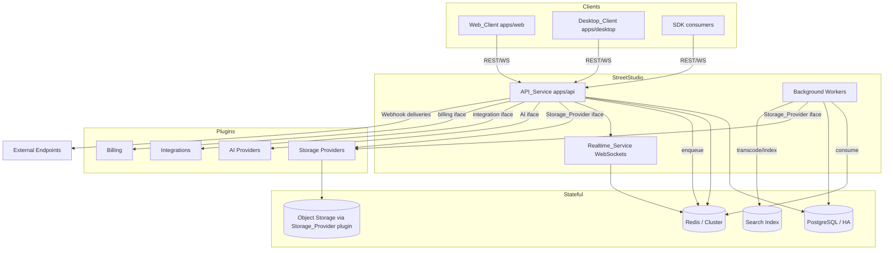
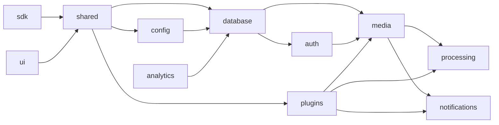
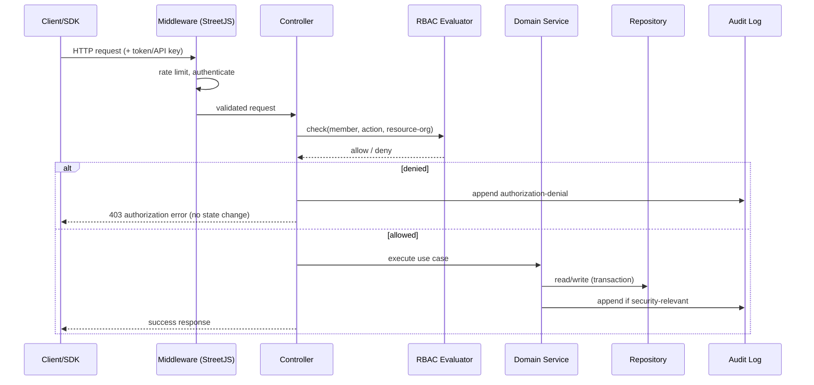
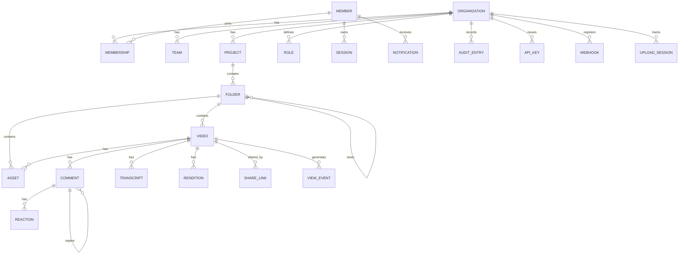

# Design Document

## Overview

StreetStudio is an independent, open-source asynchronous collaboration platform for video/screen recording, review, and knowledge sharing. It is the flagship application built on the StreetJS framework, which it consumes **exclusively** through published package versions or local package links (workspace/linked entries). StreetStudio never imports StreetJS internals, never modifies StreetJS source, and contains no StreetJS source in its own repository.

This design translates the 32 approved requirements into a concrete architecture: a modular monorepo of `apps/*` and `packages/*`, an API-first backend that exposes full UI/API parity over REST + WebSocket + Webhooks + SDK, a plugin-first extensibility model (storage, AI, integrations, billing all delivered as plugins with no hardcoded vendors), security-by-default, and horizontal scalability.

### Design Goals

- **Boundary integrity**: StreetJS is a black box consumed only via public entry points. A build-time boundary check fails the build on any disallowed import.
- **Single-responsibility packages**: each package declares one domain responsibility, exposes an entry-point-only public surface, and participates in an acyclic dependency graph enforced by CI.
- **Plugin-first**: every vendor-specific concern (storage backends, AI, chat/source-control integrations, billing) is a plugin loaded through the StreetJS plugin loader and isolated from core.
- **API-first parity**: no Web_Client capability exists that is not reachable through the public REST/WebSocket/Webhook API and the SDK.
- **Security-by-default**: rate limiting, encrypted secrets, short-lived signed upload credentials, deny-by-default authorization, and append-only audit logging are enabled without extra configuration.
- **Self-hostable & horizontally scalable**: stateless API nodes behind shared PostgreSQL and Redis (with HA/Cluster variants), background workers, and pluggable object storage.

### How StreetJS Is Used

StreetStudio delegates the following framework concerns to StreetJS public packages: HTTP serving, routing, controllers, request validation, configuration, dependency injection, sessions, PostgreSQL access, Redis access, Redis Cluster, PostgreSQL HA, queues, scheduling, storage interfaces, WebSockets, plugin loading, metrics, health checks, logging, CLI, resilience (retries/circuit breakers), and secret management. StreetStudio owns all domain logic (organizations, recording, media pipeline, comments, RBAC, sharing, etc.) in its own packages.

Where a needed capability is missing from StreetJS, StreetStudio implements it inside a StreetStudio package (importing StreetJS only through public entry points) and records the gap in documentation with a link to an external StreetJS issue — never patching StreetJS.

## Architecture

### System Context



### Runtime Topology

- **API_Service (`apps/api`)**: stateless StreetJS HTTP application hosting REST controllers and the WebSocket gateway. Multiple instances run behind a load balancer. All shared state lives in PostgreSQL, Redis, and object storage, so any instance can serve any request.
- **Background Workers**: consume StreetJS queues (backed by Redis) for the media pipeline, webhook delivery, notification fan-out, transcript indexing, and AI jobs. Workers scale independently of the API tier.
- **Realtime_Service**: a logical subsystem inside the API tier using StreetJS WebSockets. Cross-instance fan-out uses a Redis pub/sub backplane so an event produced on one node reaches subscribers connected to any node.
- **Scheduler**: StreetJS scheduling drives periodic tasks — expiring upload sessions, expiring invitations, purging expired share links, retrying stalled deliveries.

### Monorepo Structure

```
StreetStudio/
├── apps/
│   ├── api/         # API_Service: REST + WebSocket + Webhook host (StreetJS app)
│   ├── web/         # Web_Client (browser SPA)
│   ├── desktop/     # Desktop_Client (wraps web + native capture)
│   └── docs/        # Documentation site
├── packages/
│   ├── ui/          # Shared UI components (web + desktop)
│   ├── sdk/         # Public client library (REST + WebSocket)
│   ├── shared/      # Cross-cutting types, DTOs, errors, constants
│   ├── config/      # Config schema + loading via StreetJS config
│   ├── database/    # Schema, migrations, repositories (StreetJS PostgreSQL)
│   ├── auth/        # Authentication, sessions, RBAC, API keys
│   ├── media/       # Media domain: videos, assets, storage abstraction
│   ├── recording/   # Recorder capture + chunked/resumable upload client logic
│   ├── processing/  # Media pipeline: transcode, thumbnail, preview
│   ├── notifications/ # Notifications + realtime event contracts
│   ├── plugins/     # Plugin_Manager, plugin contracts, isolation
│   └── analytics/   # View events + aggregation
├── docker/          # Container images + compose
├── infrastructure/  # Deployment configuration (self-hosting)
└── docs (top-level)/ # README, ARCHITECTURE, ROADMAP, CONTRIBUTING, SECURITY, API, PLUGIN_GUIDE, MEDIA_PIPELINE, DEPLOYMENT, DECISIONS
```

Each package declares a single primary domain responsibility in its manifest and exposes functionality only through declared entry points. The dependency graph is acyclic; a representative layering:



`apps/*` may depend on `packages/*`; `packages/*` never depend on `apps/*`.

### Boundary and Import Enforcement

Two boundary rules are enforced at build/CI time (Requirements 1, 2, 22):

1. **StreetJS boundary**: no import may resolve to a StreetJS internal module or to a file-system path inside the StreetJS repository. Only StreetJS public package entry points are permitted.
2. **Package boundary**: no cross-package import may resolve to another package's internal module; only declared entry points are allowed. The graph must stay acyclic.
3. **AI vendor boundary**: platform core code (anything outside a billing/AI plugin) may not import or reference a specific AI or billing vendor implementation.

These are implemented as a custom static-analysis lint step (`packages/config` build tooling) that inspects resolved import specifiers against an allowlist and dependency-graph rules, producing a named error on violation and failing the build.

### Request Lifecycle



## Components and Interfaces

This section describes the primary subsystems, the package that owns each, and the public interfaces they expose. Interfaces are shown in TypeScript-style signatures for clarity; concrete implementation uses StreetJS DI to wire dependencies.

### Authentication & Session (`packages/auth`)

Owns Member authentication, JWT issuance, session lifecycle, OAuth/SSO, account lockout, API keys, and RBAC evaluation.

```typescript
interface AuthService {
  register(input: { email: string; password: string }): Promise<Member>;          // R3.1, R3.8
  login(input: { email: string; password: string }): Promise<AuthResult>;         // R3.2, R3.3, R3.9
  logout(sessionId: string): Promise<void>;                                        // R3.4
  verifyAccessToken(token: string): Promise<AuthContext>;                          // R3.7
  loginWithOAuth(provider: string, code: string): Promise<AuthResult>;             // R3.5, R3.10
  loginWithSSO(provider: string, assertion: string): Promise<AuthResult>;          // R3.6, R3.10
}

interface AuthResult { accessToken: string; expiresAt: Date; sessionId: string; } // token TTL <= 15 min

interface LockoutPolicy {
  recordFailure(email: string): Promise<void>;
  isLocked(email: string): Promise<boolean>;   // >=5 failures / 15 min => lock >=15 min (R3.9)
}
```

- Passwords are hashed with a memory-hard algorithm (Argon2id); plaintext is never stored.
- Access tokens are JWTs with `exp <= 15 minutes`; sessions are recorded in PostgreSQL/Redis and validated on each request so logout/expiry invalidates access (R3.2, R3.4, R3.7).
- Authentication errors are uniform and never disclose which credential failed or whether an email/API key exists (R3.3, R3.8, R18.5).
- OAuth/SSO provider failures deny sign-in and create no session (R3.10).

### API Key Service (`packages/auth`)

```typescript
interface ApiKeyService {
  create(orgId: string, actor: MemberId, name: string): Promise<{ apiKey: ApiKeyMeta; secret: string }>; // secret returned once (R18.1)
  getMeta(keyId: string): Promise<ApiKeyMeta>;      // never returns secret (R18.2)
  authenticate(presented: string): Promise<AuthContext>; // valid+non-revoked only (R18.3, R18.5)
  revoke(keyId: string, actor: MemberId): Promise<void>;  // R18.4
}
```

Only a salted hash of the secret is stored; the plaintext secret is returned exactly once at creation and is never retrievable afterward (R18.1, R18.2).

### RBAC Evaluator (`packages/auth`)

```typescript
interface AccessControl {
  can(ctx: AuthContext, action: Action, resource: ResourceRef): Promise<boolean>;
  assignRole(actor: AuthContext, orgId: string, member: MemberId, role: RoleName): Promise<void>; // R16.2, R16.5, R16.6
}
// Deny-by-default. Permissions are evaluated in the Organization scope that OWNS the resource (R16.1, R16.4).
```

Every authenticated read/modify request is evaluated against the requesting Member's Role permissions in the owning Organization's scope before the action runs; roles never leak across organizations (R16.1, R16.4, R20.4).

### Organization & Membership Service (`packages/database` domain services)

```typescript
interface OrgService {
  createOrg(actor: AuthContext, name: string): Promise<Organization>;          // 1..200 chars (R4.1, R4.7)
  invite(actor: AuthContext, orgId: string, email: string): Promise<Invitation>; // expires +7d (R4.2, R4.8)
  acceptInvitation(token: string, member: MemberId): Promise<Membership>;      // R4.3, R4.9
  createTeam(actor: AuthContext, orgId: string, name: string): Promise<Team>;  // R4.4
  assignToTeam(actor: AuthContext, teamId: string, member: MemberId): Promise<void>; // R4.5
  removeMember(actor: AuthContext, orgId: string, member: MemberId): Promise<void>; // R26.2, R26.6
  updateSettings(actor: AuthContext, orgId: string, patch: OrgSettings): Promise<Organization>; // R26.1, R26.5
}
```

Creating an organization assigns the creator the Administrator role. Removing the last Administrator is rejected (R26.6). Membership operations are org-scoped and authorization-checked (R4.6).

### Content Hierarchy Service (`packages/media`)

```typescript
interface ContentService {
  createProject(actor: AuthContext, orgId: string, name: string): Promise<Project>; // 1..255 (R5.1, R5.6, R5.8)
  createFolder(actor: AuthContext, parent: FolderRef, name: string): Promise<Folder>; // depth <=10 (R5.2, R5.3, R5.8)
  moveVideo(actor: AuthContext, videoId: string, targetFolder: FolderRef): Promise<Video>; // same-org only (R5.4, R5.7)
  createWorkspace(actor: AuthContext, orgId: string, name: string): Promise<Workspace>; // R5.5
}
```

Moving a Video within the same Organization preserves identity, comments, transcripts, and permissions; cross-organization moves are rejected (R5.4, R5.7). Folder nesting is capped at depth 10 (R5.3).

### Recorder (`packages/recording`, consumed by `apps/web` and `apps/desktop`)

Client-side capture plus the chunked/resumable upload client.

```typescript
interface Recorder {
  start(sources: CaptureSources): Promise<RecordingSession>; // screen/window/region (R6.1..R6.4)
  pause(): void;   // suspend capture, retain media (R6.8)
  resume(): void;
  stop(): Promise<Recording>; // finalize <=10s then upload (R6.9)
}
interface CaptureSources { screen: ScreenTarget; camera?: boolean; microphone?: boolean; systemAudio?: boolean; }
```

- Missing/unsupported system audio continues without it and notifies the Member (R6.5); denied capture permission aborts and retains nothing (R6.6).
- Cursor highlighting/drawing tools and keyboard shortcuts are provided during recording (R6.7, R6.12).
- Offline stops persist locally and upload with up to 5 retries when connectivity returns (R6.10, R6.11).

### Chunked Upload Service (`apps/api` upload controller + `packages/media`)

```typescript
interface UploadService {
  initSession(actor: AuthContext, meta: UploadMeta): Promise<UploadSession>; // totalChunks known
  putChunk(sessionId: string, index: number, bytes: Buffer, checksum: string): Promise<ChunkAck>; // 1..100 MB (R7.1, R7.4)
  status(sessionId: string): Promise<UploadStatus>;
  complete(sessionId: string): Promise<Video>; // assemble in order (R7.3)
}
```

- Each chunk (1 MB–100 MB) is integrity-checked; failures are rejected without persisting, retried up to 3 times, and exhaustion aborts the session (R7.4, R7.5).
- Resuming within the 24h session lifetime continues from the chunk after the last acknowledged one without retransmitting acknowledged chunks (R7.2); sessions idle past 24h expire and discard partial chunks (R7.6).
- Each acknowledgment emits an upload-progress realtime event reporting acknowledged/total (R7.7).

### Media Pipeline (`packages/processing`, run in workers)

```typescript
interface MediaPipeline {
  enqueue(videoId: string): Promise<void>;         // within 5s of upload completion (R8.1)
  process(job: ProcessingJob): Promise<ProcessingResult>;
}
interface ProcessingResult {
  thumbnail: AssetRef;         // exactly one (R8.2)
  preview: AssetRef;           // 3..10s (R8.3)
  renditions: Rendition[];     // >=3 ABR renditions (R8.4)
  status: 'ready' | 'failed';
}
```

Processing emits status transitions (`queued|processing|ready|failed`) to Members with access within 2s per transition (R8.5). Failures retry up to 3 times; on exhaustion the pipeline records failure, retains the original source, and emits a failure event (R8.6). Success marks the Video `ready` (R8.7).

### Storage Abstraction (`packages/media` interface, providers are plugins)

```typescript
interface StorageProvider {
  put(key: string, stream: ReadableStream): Promise<PutResult>;   // ack within 30s or fail (R9.5)
  get(key: string): Promise<ReadableStream>;
  signUploadTarget(key: string, ttlSeconds: number): Promise<SignedTarget>; // 60..3600, default 900 (R9.6)
  healthCheck(): Promise<void>;   // connectivity check on activation (R9.4)
}
```

Persistence flows exclusively through this interface (R9.1). Providers for Local, S3, R2, Azure Blob, GCS, and MinIO are plugins (R9.2). Activating a provider with missing config or a failing connectivity check is rejected and retains the prior provider (R9.4). Signed upload credentials for direct-to-storage uploads expire within 15 minutes (R9.6 default 900s, R29.3), and expired targets are rejected (R9.7).

### Streaming & Playback (`packages/media`)

```typescript
interface PlaybackService {
  getManifest(ctx: AccessContext, videoId: string): Promise<StreamManifest>; // ready only, <=3s (R10.1, R10.3)
}
```

Playback requires view permission or a valid share credential; denied/without-permission requests return no manifest and an authorization error (R10.2, R10.4, R10.5).

### Comments, Threads, Reactions (`packages/media`)

```typescript
interface CommentService {
  post(ctx: AccessContext, videoId: string, body: string, timestamp?: number): Promise<Comment>; // 1..5000, 0..duration (R11.1, R11.2, R11.8, R11.9)
  reply(ctx: AccessContext, parentId: string, body: string): Promise<Comment>; // R11.3
  react(ctx: AccessContext, target: ReactionTarget, type: ReactionType): Promise<void>; // <=1 per type/member/target (R11.5)
  mention(commentId: string, mentioned: MemberId): Promise<void>; // notify within 2s if has view access (R11.4)
}
```

New comments and typing indicators fan out to concurrent viewers within 2s (R11.6, R13.2).

### Notifications (`packages/notifications`)

```typescript
interface NotificationService {
  create(memberId: string, event: EventRef): Promise<Notification>; // within 5s, respects prefs (R12.1, R12.4)
  markRead(memberId: string, notificationId: string): Promise<void>; // ownership-checked (R12.3, R12.6)
  deliverPending(memberId: string): Promise<void>; // on reconnect within 5s (R12.5)
}
```

Connected members receive notifications within 2s (R12.2); undelivered ones are retained and delivered within 5s of reconnect (R12.5).

### Realtime_Service (`packages/notifications` contracts + `apps/api` gateway)

```typescript
interface RealtimeGateway {
  join(memberId: string, workspaceId: string): Promise<void>;  // presence event to others <=2s (R13.1)
  leave(memberId: string, workspaceId: string): Promise<void>; // departure <=2s (R13.3)
  emit(event: RealtimeEvent, audience: Audience): Promise<void>;
}
// Event types: upload-progress, processing-status, live-comment, notification,
// presence-join, presence-leave, typing-start, typing-stop, workspace-event (R13.4)
```

Delivered over StreetJS WebSockets with a Redis backplane for cross-node fan-out. Dropped connections emit a presence-departure within 5s (R13.6); events for members with no active connection are discarded without affecting others (R13.7). Typing indicators start on typing and stop after 5s of inactivity (R13.2, R13.5).

### Search (`packages/media` + search index)

```typescript
interface SearchService {
  search(ctx: AuthContext, query: string, page?: Cursor): Promise<SearchPage>; // 1..500 chars, <=3s, <=100/page (R14.1, R14.3, R14.5, R14.6)
}
interface SearchPage { results: SearchHit[]; nextCursor?: Cursor; }
interface SearchHit { resource: ResourceRef; transcriptPosition?: number; } // R14.2
```

Results are always filtered to the requesting Member's authorized scope (R14.4). Transcript matches include the matching playback position (R14.2).

### Sharing & Content Permissions (`packages/media`)

```typescript
interface ShareService {
  createLink(ctx: AccessContext, videoId: string, opts: ShareOptions): Promise<ShareCredential>; // globally unique (R15.1)
  revoke(ctx: AccessContext, credentialId: string): Promise<void>; // R15.3
  resolve(credential: string, passcode?: string): Promise<ShareAccess>; // expiry/revoke/passcode (R15.2, R15.5, R15.6, R15.7)
}
interface ShareOptions { expiresAt?: Date; passcode?: string; }
```

Passcode-protected links lock for at least 15 minutes after 5 consecutive incorrect attempts (R15.7). All resource reads/writes enforce content permission and make no change on denial (R15.4).

### Audit Log (`packages/database`, append-only)

```typescript
interface AuditLog {
  append(entry: { actor: string; action: string; targetId: string; orgId: string; at: Date }): Promise<void>; // <=5s, ms precision (R17.1)
  query(actor: AuthContext, orgId: string, page?: Cursor): Promise<AuditEntry[]>; // desc, org-scoped, admin-only (R17.3, R17.5)
}
// No update/delete operations are exposed; storage layer rejects mutation (R17.2, R17.6).
```

Records authentication events, authorization denials, sharing changes, and administrative actions (R17.4).

### Webhooks (`apps/api` + worker delivery)

```typescript
interface WebhookService {
  register(ctx: AuthContext, eventType: string, url: string): Promise<Subscription>; // HTTPS, <=2048, supported type (R19.1, R19.2)
  delete(ctx: AuthContext, subId: string): Promise<void>; // stop within 60s (R19.7)
  deliver(event: PlatformEvent): Promise<void>; // signed, within 30s (R19.3, R19.4)
}
// Delivery: 10s response timeout; retry up to 5 more times with exponential backoff (R19.5, R19.6).
```

### SDK (`packages/sdk`)

Generated/maintained from the public API contract; provides typed client access to every public REST and WebSocket interface (R20.2). Released in lockstep with contract changes and honoring the 90-day deprecation window for breaking changes (R20.3, R20.6).

### Plugin_Manager (`packages/plugins`)

```typescript
interface PluginManager {
  discoverAndLoad(): Promise<LoadReport>;             // via StreetJS loader, <=30s/plugin (R21.1, R21.5)
  enable(actor: AuthContext, pluginId: string): Promise<void>;  // activate+register <=10s (R21.2, R21.3)
  disable(actor: AuthContext, pluginId: string): Promise<void>; // deactivate+unregister <=10s (R21.4)
}
interface PluginContext { /* no write access to platform core (R21.6, R21.7) */ }
```

Plugins run in an isolated context with no write access to core code; attempts to modify core are denied and recorded (R21.6, R21.7). A plugin that fails to load is recorded and excluded, while other plugins continue (R21.5). Failed activation leaves the plugin deactivated with prior registration state intact (R21.3). Integration plugins are supported for Slack, Discord, GitHub, GitLab, Jira, Linear, Microsoft Teams, and Notion (R21.8).

### AI Capability Router (`packages/plugins` + core services)

```typescript
interface AiRouter {
  route(capability: AiCapability, req: AiRequest): Promise<AiResult>; // transcription/summarization/action-items/semantic-search (R22.2)
}
// If no provider enabled for capability -> reject AI request <=2s; non-AI features unaffected (R22.3).
// Provider failure or >30s timeout -> abort AI request; non-AI features unaffected (R22.5).
// Core code contains no vendor implementation; build fails on vendor reference (R22.4, R22.6).
```

### Billing Abstraction (`packages/plugins` + core services)

```typescript
interface BillingGateway {
  execute(op: BillingOperation): Promise<BillingResult>; // routes to the single enabled billing plugin (R27.2)
}
// Zero direct provider references outside a billing plugin (R27.1).
// No billing plugin -> core features work; billing ops rejected "not configured" (R27.3).
// >1 billing plugin enabled -> reject configuration; route nothing (R27.4).
// Plugin failure or >30s -> error; no partial application (R27.5).
```

### Developer Mode (`packages/media` + `packages/recording`)

```typescript
interface DeveloperAssets {
  attachCodeSnippet(ctx: AccessContext, videoId: string, code: string): Promise<Asset>;    // 1..100000 (R23.1, R23.5)
  attachMarkdown(ctx: AccessContext, videoId: string, md: string): Promise<Asset>;         // 1..100000 (R23.3, R23.5)
  recordTerminal(ctx: AccessContext, videoId: string, session: TerminalCapture): Promise<Asset>; // R23.2
  attachApiRecording(ctx: AccessContext, videoId: string, rec: ApiRecording): Promise<Asset>;    // R23.4
}
// All rejected with "Developer Mode required" when the mode is disabled (R23.6).
```

### Engineering Reviews (`packages/media` + source control plugin)

```typescript
interface ReviewService {
  linkPullRequest(ctx: AccessContext, videoId: string, pr: PrRef): Promise<Association>; // enabled plugin only (R24.1, R24.2, R24.4, R24.6)
  postReviewComment(ctx: AccessContext, videoId: string, body: string, timestamp: number): Promise<Comment>; // 1..5000, 0..duration (R24.3, R24.5)
}
```

### Knowledge Base (`packages/media`)

```typescript
interface KnowledgeBase {
  indexTranscript(videoId: string, transcript: Transcript): Promise<void>; // searchable <=30s (R25.1)
  storeSummary(videoId: string, summary: string): Promise<void>;           // 1..10000, provider-produced (R25.2)
  linkDoc(ctx: AccessContext, videoId: string, url: string): Promise<DocLink>; // 1..2048, <=100/video (R25.3..R25.6)
}
```

### Analytics (`packages/analytics`)

```typescript
interface AnalyticsService {
  recordView(memberId: string, videoId: string, at: Date): Promise<void>; // org-scoped, <=5s (R28.1)
  aggregate(actor: AuthContext, orgId: string, range: TimeRange): Promise<Metrics>; // admin-only, <=5s (R28.2, R28.4, R28.5)
}
interface Metrics { totalViews: number; distinctViewers: number; totalWatchDuration: number; }
```

Analytics never include data from other organizations (R28.3), require valid time ranges (R28.5), and are Administrator-only (R28.4).

### Security Middleware & Deployment (`apps/api`, `packages/config`)

- **Rate limiting**: default 100 requests / 60s rolling window per client; excess requests are rejected with a retry-after indication (R29.1).
- **Secret management**: all secrets stored encrypted via the StreetJS secret interface; never plaintext (R29.2).
- **Auth-required by default**: unauthenticated/invalid-auth requests to non-public endpoints are denied with no state change; public endpoints are documented as requiring no auth (R29.4, R29.5).
- **Startup/health**: startup validates required config and aborts with named errors on missing/invalid values (R30.3); health and metrics endpoints are exposed via StreetJS interfaces; health reflects dependency reachability (R30.2, R30.4). HA runs against PostgreSQL HA and Redis Cluster and reconnects without operator restart (R30.5, R30.6).

## Data Models

Persisted in PostgreSQL via `packages/database` repositories (StreetJS PostgreSQL access). Identifiers are UUIDs. All tenant-scoped tables carry `organization_id` and are indexed on it to enforce org isolation.



### Core Entities

**Member**
- `id`, `email` (unique, case-insensitive), `password_hash` (Argon2id, nullable for SSO-only), `created_at`.

**Session**
- `id`, `member_id`, `issued_at`, `expires_at`, `revoked_at?`. Access-token JWTs reference a session; validity requires a live, non-revoked session (R3.2, R3.4, R3.7).

**Organization**
- `id`, `name` (1–200), `settings` (JSON), `created_at`.

**Membership**
- `organization_id`, `member_id`, `role_id`, `created_at`. Uniqueness on (`organization_id`, `member_id`).

**Role**
- `id`, `organization_id`, `name`, `permissions` (set of `Action`). Scoped to its organization only (R16.4).

**Team** / **TeamMembership**
- Team: `id`, `organization_id`, `name`. TeamMembership: (`team_id`, `member_id`).

**Invitation**
- `id`, `organization_id`, `email`, `token`, `status` (`pending|accepted|revoked|expired`), `created_at`, `expires_at = created_at + 7d` (R4.2, R4.9).

**Project**
- `id`, `organization_id`, `name` (1–255), `created_at`.

**Folder**
- `id`, `project_id`, `parent_folder_id?`, `name` (1–255), `depth` (0–9; ≤10 levels) (R5.3).

**Video**
- `id`, `organization_id`, `folder_id?`, `title`, `duration_seconds`, `status` (`uploading|queued|processing|ready|failed`), `source_object_key`, `developer_mode` flag, `created_at`. Identity is stable across folder moves (R5.4).

**Rendition**
- `id`, `video_id`, `quality`, `object_key`, `bitrate`. ≥3 per ready video (R8.4).

**Asset**
- `id`, `video_id?`, `folder_id?`, `type` (`thumbnail|preview|image|markdown|code_snippet|terminal|api_recording`), `object_key_or_body`, `created_at`. Thumbnail/preview generated by the pipeline (R8.2, R8.3); developer assets gated by Developer Mode (R23).

**Transcript**
- `id`, `video_id`, `segments` (`[{ start, end, text }]`), `indexed_at`. Powers transcript search with playback positions (R14.2, R25.1).

**Summary**
- `id`, `video_id`, `body` (1–10000), `source_plugin_id` (R25.2).

**Comment**
- `id`, `video_id`, `parent_comment_id?`, `author_id`, `body` (1–5000), `timestamp_seconds?` (0–duration), `created_at` (R11).

**Reaction**
- (`target_type`, `target_id`, `member_id`, `type`) unique — enforces at most one reaction of each type per Member per target (R11.5).

**Notification**
- `id`, `member_id`, `event_type`, `source_resource_id`, `created_at`, `read_at?`, `delivered_at?` (R12).

**NotificationPreference**
- (`member_id`, `event_type`, `enabled`) (R12.4).

**ShareLink**
- `id`, `video_id`, `credential` (globally unique), `expires_at?`, `passcode_hash?`, `revoked_at?`, `failed_attempts`, `locked_until?` (R15).

**UploadSession**
- `id`, `organization_id`, `video_id`, `total_chunks`, `acked_chunks` (bitmap/count), `last_ack_at`, `expires_at = last_ack_at + 24h`, `status` (`open|completed|expired|aborted`), per-chunk `attempts` (R7).

**AuditEntry** (append-only)
- `id`, `organization_id`, `actor_id`, `action`, `target_id`, `at` (UTC, ≥ms precision). No update/delete path (R17.1, R17.2).

**ApiKey**
- `id`, `organization_id`, `name` (1–255), `secret_hash`, `permissions`, `created_at`, `revoked_at?`. Secret plaintext returned once (R18).

**Webhook**
- `id`, `organization_id`, `event_type`, `url` (HTTPS ≤2048), `signing_secret`, `created_at`. Delivery attempts tracked separately (R19).

**PullRequestLink**
- `id`, `video_id`, `plugin_id`, `pr_ref`, `created_at` (R24).

**DocLink**
- `id`, `video_id`, `url` (1–2048), `created_at`. ≤100 per video (R25.3, R25.6).

**ViewEvent**
- `id`, `organization_id`, `video_id`, `member_id`, `at` (R28.1). Aggregations derive views/distinct viewers/watch duration.

**Plugin**
- `id`, `type` (`storage|ai|integration|billing`), `enabled`, `config` (secrets via secret manager), `load_state` (R21).

### Shared DTOs and Errors (`packages/shared`)

A single error taxonomy is shared across REST/WebSocket/SDK so behavior is uniform (see Error Handling). DTOs are the serialized wire representations of the entities above; the SDK consumes these types directly to guarantee parity.
