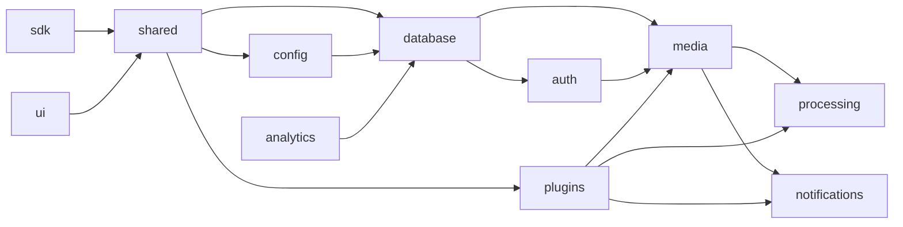
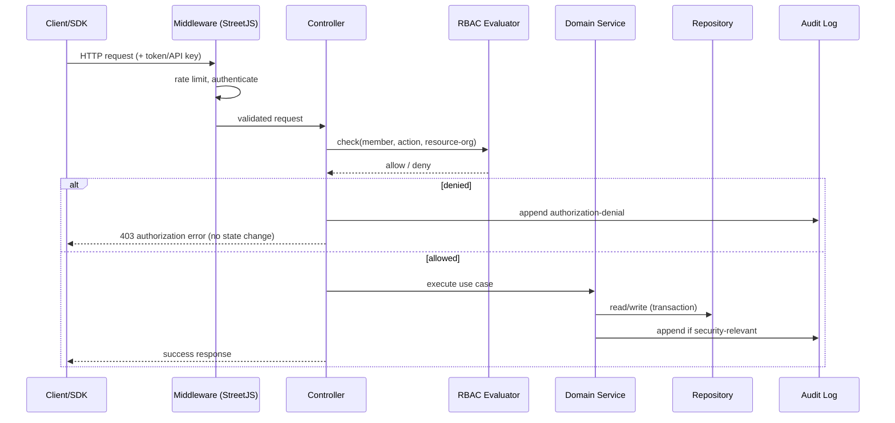

# Architecture

StreetStudio is an open-source asynchronous collaboration platform for
video/screen recording, review, and knowledge sharing. It is the flagship
application built on the **StreetJS** framework, which it consumes exclusively
through published package versions or local package links.

This document describes the implemented architecture: the monorepo layout, how
StreetJS is consumed, the package boundaries that are enforced at build time,
the request lifecycle, and the runtime topology.

## Design goals

- **Boundary integrity** — StreetJS is treated as a black box, consumed only
  through public package entry points. A build-time boundary check fails the
  build on any disallowed import (see [DECISIONS](./DECISIONS.md), ADR-0001).
- **API-first parity** — every Web_Client capability is reachable through the
  public REST/WebSocket/Webhook surface and mirrored by the SDK. The public
  operation catalog (`apps/api/src/http/operations.ts`) is the single source of
  truth for this parity guarantee (see [API](./API.md)).
- **Deny-by-default security** — non-public endpoints require authentication and
  RBAC authorization scoped to the owning organization; nothing leaks across
  organizations.
- **Plugin-first extensibility** — storage, AI, integrations, and billing are
  delivered as plugins with no hardcoded vendors in platform core.
- **Self-hostable & horizontally scalable** — stateless API nodes behind shared
  PostgreSQL and Redis (with HA/Cluster variants), background workers, and
  pluggable object storage.

## How StreetJS is used

StreetStudio delegates framework concerns to StreetJS public packages: HTTP
serving, routing, controllers, request validation, configuration, dependency
injection, sessions, PostgreSQL access, Redis access, Redis Cluster,
PostgreSQL HA, queues, scheduling, storage interfaces, WebSockets, plugin
loading, metrics, health checks, logging, CLI, resilience (retries/circuit
breakers), and secret management.

StreetStudio owns all domain logic — organizations, recording, the media
pipeline, comments, RBAC, sharing, notifications, analytics — in its own
packages. Where a capability is missing from StreetJS, StreetStudio implements
it inside a StreetStudio package (importing StreetJS only through public entry
points) and records the gap in the [README](../README.md) StreetJS gap register
with a link to an external StreetJS issue. StreetJS source is never modified
and never vendored into this repository (Requirement 1).

## Monorepo structure

```
StreetStudio/
├── apps/
│   ├── api/                # API_Service: REST + WebSocket + Webhook host (StreetJS app)
│   ├── dashboard/          # Dashboard web application (Web_Client SPA)
│   ├── desktop/            # Desktop_Client (wraps dashboard + native capture)
│   ├── recorder-extension/ # Browser recorder extension (toolbar capture + upload)
│   └── docs/               # Documentation site
├── packages/
│   ├── ui/            # Shared UI components (web + desktop)
│   ├── sdk/           # Public client library (REST + WebSocket)
│   ├── shared/        # Cross-cutting framework/wire types, DTOs, errors, constants
│   ├── types/         # Product-level shared type aliases (client packages)
│   ├── config/        # Config schema + loading via StreetJS config; boundary tooling
│   ├── database/      # Schema, migrations, repositories, audit log
│   ├── auth/          # Authentication, sessions, RBAC, API keys
│   ├── organizations/ # Organizations, teams, membership, invitations, admin
│   ├── projects/      # Content hierarchy: projects, folders, workspaces
│   ├── media/         # Videos, assets, uploads, sharing, dev-assets, reviews
│   ├── storage/       # Storage abstraction + StorageProvider contract (providers are plugins)
│   ├── knowledge/     # Transcript indexing, summaries, doc links (knowledge base)
│   ├── comments/      # Comments, threads, reactions, mentions
│   ├── search/        # Search + transcript search (authorized scope)
│   ├── player/        # Streaming/playback: ABR manifest with permission & share-credential gating
│   ├── timeline/      # Timeline model: tracks, clips, creator markers
│   ├── editor/        # Browser editor model: trim/split/merge/crop/speed/captions/annotations
│   ├── recorder/      # Recorder capture + chunked/resumable upload client
│   ├── processing/    # Media pipeline: transcode, thumbnail, preview
│   ├── notifications/ # Notifications + event contracts
│   ├── realtime/      # Realtime gateway: presence, typing, live fan-out (Redis backplane)
│   ├── plugins/       # Plugin_Manager, plugin contracts, isolation
│   ├── ai/            # AI capability router (routing only; providers are plugins)
│   ├── integrations/  # Integration framework: contract, registry, built-in catalog
│   └── analytics/     # View events + aggregation
├── docker/          # Container images + compose
├── infrastructure/  # Deployment configuration (self-hosting)
└── docs/            # This documentation set
```

`apps/*` may depend on `packages/*`; `packages/*` never depend on `apps/*`.
Each package declares a single primary domain responsibility
(`streetstudio.domain` in its manifest) and exposes its public surface only
through its declared entry point (`exports["."]`). The dependency graph is
acyclic; a representative layering:



## Boundary and import enforcement

Three boundary rules are enforced at build/CI time (Requirements 1, 2, 22),
implemented as a custom static-analysis step in `packages/config` that inspects
resolved import specifiers against an allowlist and dependency-graph rules,
producing a named error on violation and failing the build:

1. **StreetJS boundary** — no import may resolve to a StreetJS internal module
   or to a file-system path inside the StreetJS repository. Only StreetJS public
   package entry points are permitted. Violations produce
   `DISALLOWED_STREETJS_IMPORT`.
2. **Package boundary** — no cross-package import may resolve to another
   package's internal module; only declared entry points are allowed, and the
   graph must stay acyclic. Violations produce `DISALLOWED_INTERNAL_IMPORT`.
3. **AI/billing vendor boundary** — platform core (anything outside a billing/AI
   plugin) may not import or reference a specific AI or billing vendor. Violations
   produce `DISALLOWED_AI_VENDOR`.

Run the checks locally:

```bash
npm run boundary:check   # import allowlist + AI-vendor boundary
npm run graph:check      # acyclic cross-package dependency graph
```

## Request lifecycle

Every request — whether from the Web_Client, the SDK, or a direct API caller —
passes through the same middleware and authorization pipeline, so a public API
request is subject to identical authorization as the equivalent Web_Client
request (R20.4).



## Runtime topology

- **API_Service (`apps/api`)** — a stateless StreetJS HTTP application hosting
  REST controllers and the WebSocket gateway. Multiple instances run behind a
  load balancer. All shared state lives in PostgreSQL, Redis, and object
  storage, so any instance can serve any request.
- **Background workers** — consume StreetJS queues (backed by Redis) for the
  media pipeline, webhook delivery, notification fan-out, transcript indexing,
  and AI jobs. Workers scale independently of the API tier.
- **Realtime_Service** — a logical subsystem inside the API tier using StreetJS
  WebSockets. Cross-instance fan-out uses a Redis pub/sub backplane so an event
  produced on one node reaches subscribers connected to any node.
- **Scheduler** — StreetJS scheduling drives periodic tasks: expiring upload
  sessions, expiring invitations, purging expired share links, and retrying
  stalled deliveries.

The `api` and `worker` roles are the same build artifact selecting behavior via
`STREETSTUDIO_ROLE`. See [DEPLOYMENT](./DEPLOYMENT.md) for operating the stack.

## Data model overview

Domain state is persisted in PostgreSQL via `packages/database` repositories
(StreetJS PostgreSQL access). Identifiers are UUIDs. All tenant-scoped tables
carry `organization_id` and are indexed on it to enforce organization
isolation. Core entities include Member, Session, Organization, Membership,
Role, Team, Invitation, Project, Folder, Video, Asset, Comment, Reaction,
Transcript, Rendition, ShareLink, Notification, AuditEntry, ApiKey, Webhook,
ViewEvent, and UploadSession.

## Related documents

- [MEDIA_PIPELINE](./MEDIA_PIPELINE.md) — recording, chunked upload, and processing.
- [PLUGIN_GUIDE](./PLUGIN_GUIDE.md) — the plugin model and contracts.
- [API](./API.md) — the public endpoint reference.
- [SECURITY](./SECURITY.md) — the security model and defaults.
- [DECISIONS](./DECISIONS.md) — architecture decision records.
